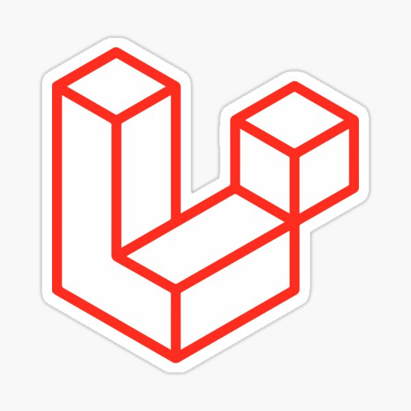

<h1 align="center">
   Bienvenidos a "DiscorDia". 
   Tu App sobre Videojuegos.
</h1>

:speech_balloon: [About](#id1)   

:hammer: [Herramientas](#id2)

:exclamation: [Requisitos y extras](#id5)

:collision: [Proximamente](#id7)

:smile: [Thanks](#id8)

---

## **Sobre el proyecto**

Realización del backend de una app donde los usuarios pueden crear salas (parties) donde chatear sobre sus juegos favoritos.

Es el 9º proyecto de la  [GeeksHubs Academy](https://bootcamp.geekshubsacademy.com/) Full Stack Developer Bootcamp, realizado con php y Laravel.

---
**Fecha de comienzo:** 12 / Jul /2021
**Fecha de entrega:** 18 / Jul / 2021

**Realizado por:**
* [Pedro Agulló Marco](https://github.com/PedroAgullo)

---

***
## **Herramientas**

**DBeaver**

|  | Visual Studio Code |

|  | PHP |

|  | Laravel  |

|  | Docker  |

|  | Git |

***

## Requisitos del proyecto

Los requisitos funcionales de la aplicación son los siguientes:
* Los usuarios se tienen que poder registrar a la aplicación, estableciendo un usuario/contraseña.
* Los usuarios tienen que autenticarse a la aplicación haciendo login.
* Los usuarios tienen que poder crear Partías (grupos) por un determinado videojuego.
* Los usuarios tienen que poder buscar Partías seleccionando un videojuego.
* Los usuarios pueden entrar y salir de una Party.
* Los usuarios tienen que poder enviar mensajes a la Party. Estos mensajes tienen que poder ser editados y borrados por su usuario creador.
* Los mensajes que existan a una Party se tienen que visualizar como un chat común.
* Los usuarios pueden introducir y modificar sus datos de perfil, por
ejemplo, su usuario de Steam.
* Los usuarios tienen que poder hacer logout de la aplicación web.

## Puntos extra

**Usuario**

  * Crear nuevos juegos.
  * Editar/eliminar los juegos que él ha creado.
  * Ver los juegos por género.
  * Ver todos los juegos disponibles.
  * Buscar los juegos por título.
  * Ver todas las parties que hay creadas.
  * Ver parties por ID del juego.
  * Buscar parties por nombre.
  * Crear parties con la temática que elija.
  * Crear partis privadas con password.
  * Borrar parties que haya creado.
  * Entrar/salir a una party.
  * Escribir mensajes en las parties donde haya entrado.
  * Puede editar/eliminar sus mensajes.
  * Ve todos los mensajes de una party donde haya entrado en forma de chat.
  

**Admin**

  * Busqueda de usuarios por email e ID y editar sus datos.
  * Eliminar/editar usuarios.
  * Ver todos los usuarios.
  * Estadísticas, numero de unidades vendidas por tipo de venta e ingresos por tipo de venta.

***
## **Proximamente**

* Activación de cuenta de usuario por email.

***
## **Thanks**

Gracias a todos mis compañeros por su ayuda en este proyecto. Y en especial a mi mujer y a mis hijos por el apoyo que me dan.

 
 

[UP](#top)
